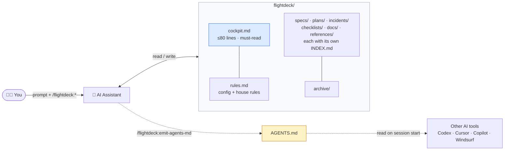

# Architecture

`flightdeck/` is the **source of truth**. Your AI reads and writes it directly. `AGENTS.md` is an *emitted view* of it — a wire format for tools that don't speak the protocol natively.

- **You → AI** — drive the session via prompts and the `/flightdeck:*` commands.
- **AI ↔ flightdeck/** — the AI reads `cockpit.md` on entry, then reads/writes folders on demand.
- **AI → AGENTS.md** — `/flightdeck:emit-agents-md` regenerates a fenced block inside `AGENTS.md` from `cockpit.md`.
- **AGENTS.md → other tools** — any tool that reads `AGENTS.md` (Codex, Cursor, Copilot, Windsurf, Continue, Cody) sees current project state without speaking flightdeck.

There's no database, server, or background process — it's plain files. Reads are **INDEX-first**: each folder's `INDEX.md` is a derived table (file · status · one-line summary) the AI scans before opening individual files, so token cost scales with folder count, not file count.

One deterministic enhancement: on hosts that fire end-of-turn hooks (Claude/Codex `Stop`, Cursor `stop`, Gemini `AfterAgent`), a passive **turn-end hook** regenerates the mechanical board regions (cockpit `## 进行中` + each `INDEX.md`) so they never go stale between landings. It never blocks or writes judgment fields, and the protocol does not depend on it.
